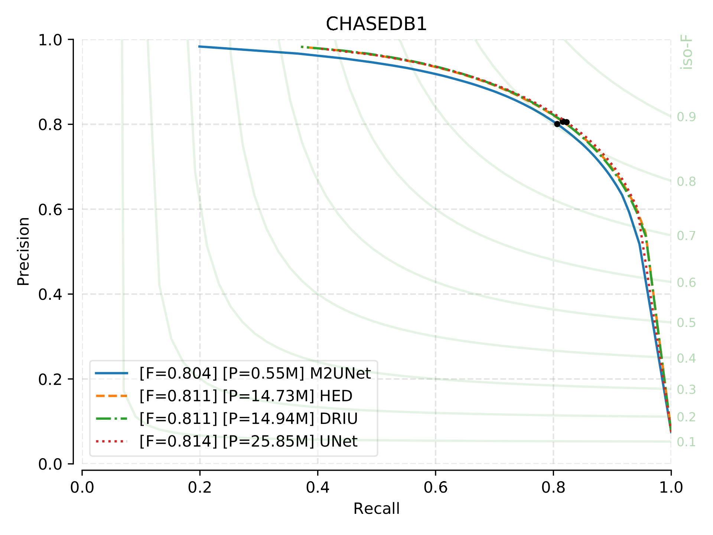
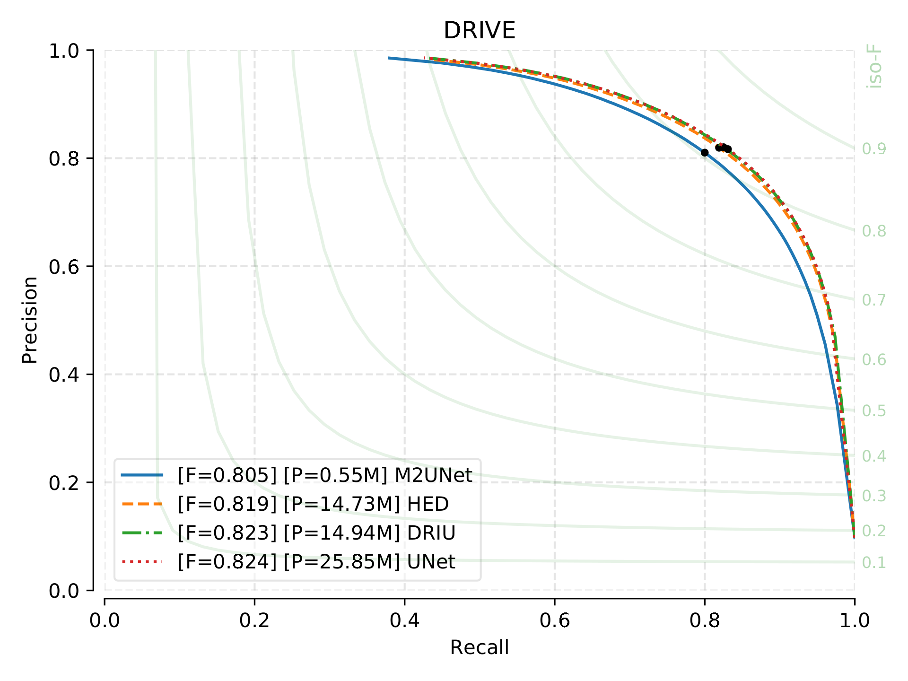
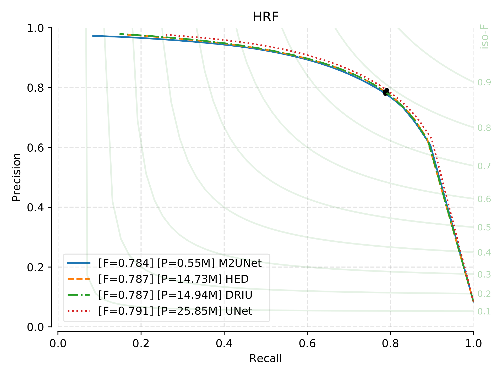
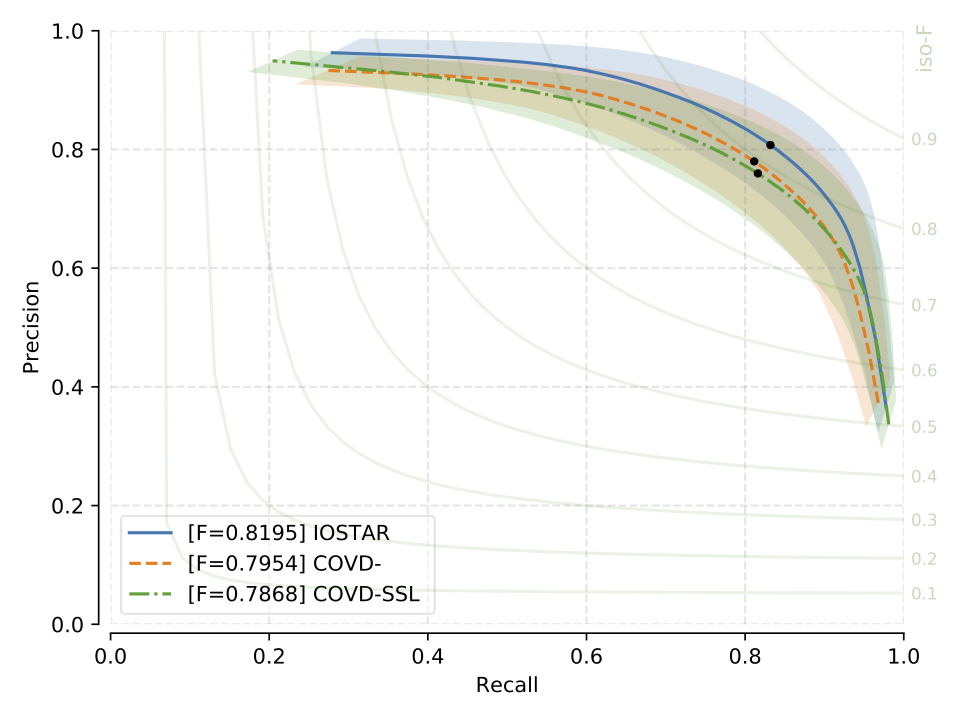
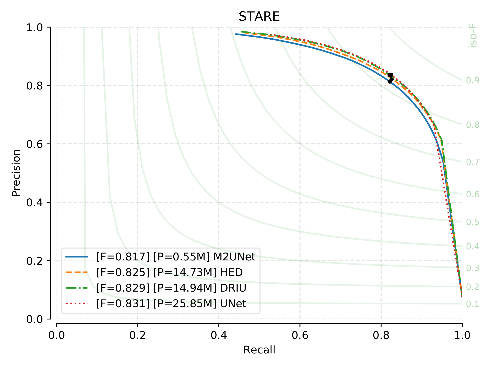

.. -*- coding: utf-8 -*-
.. _bob.ip.binseg.benchmarkresults:

==================
Benchmark Results
==================

F1 Scores
===========

* Benchmark results for models: DRIU, HED, M2UNet and U-Net.
* Models are trained and tested on the same dataset using the train-test split as indicated in :ref:`bob.ip.binseg.datasets`
* standard-deviations across all test images are indicated in brakets

+----------+-----------------+-----------------+-----------------+-----------------+-----------------+
| F1 (std) | CHASEDB1        | DRIVE           | HRF1168         | IOSTAR          | STARE           |
+----------+-----------------+-----------------+-----------------+-----------------+-----------------+
| DRIU     | 0.8114 (0.0206) | 0.8226 (0.0142) | 0.7865 (0.0545) | 0.8273 (0.0199) | 0.8286 (0.0368) |
+----------+-----------------+-----------------+-----------------+-----------------+-----------------+
| HED      | 0.8111 (0.0214) | 0.8192 (0.0136) | 0.7868 (0.0576) | 0.8275 (0.0201) | 0.8250 (0.0375) |
+----------+-----------------+-----------------+-----------------+-----------------+-----------------+
| M2UNet   | 0.8035 (0.0195) | 0.8051 (0.0141) | 0.7838 (0.0572) | 0.8194 (0.0201) | 0.8174 (0.0409) |
+----------+-----------------+-----------------+-----------------+-----------------+-----------------+
| UNet     | 0.8136 (0.0209) | 0.8237 (0.0145) | 0.7914 (0.0516) | 0.8203 (0.0190) | 0.8306 (0.0421) |
+----------+-----------------+-----------------+-----------------+-----------------+-----------------+

   CHASE_DB1: Precision vs Recall curve, F1 scores and
   number of parameter of each model.

   DRIVE: Precision vs Recall curve, F1 scores and
   number of parameter of each model.

   HRF: Precision vs Recall curve, F1 scores and
   number of parameter of each model.

   IOSTAR: Precision vs Recall curve, F1 scores and
   number of parameter of each model.

   STARE: Precision vs Recall curve, F1 scores and
   number of parameter of each model.
