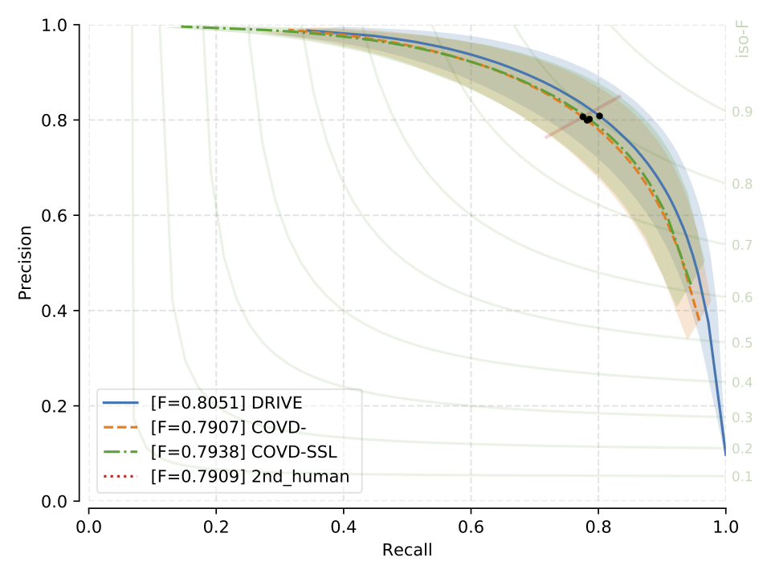
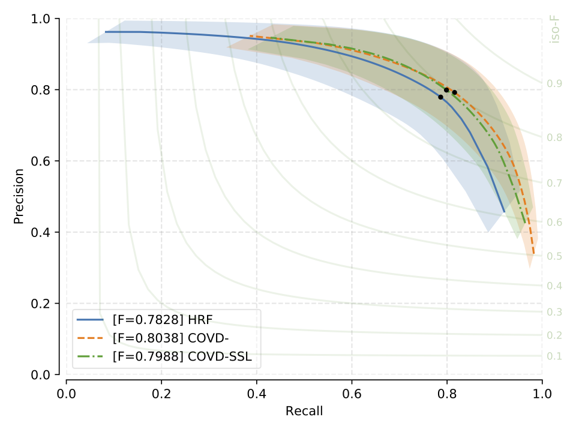

.. -*- coding: utf-8 -*-
.. _bob.ip.binseg.benchmarkresults:

==================
Benchmark Results
==================

F1 Scores
===========

* Benchmark results for models: DRIU, HED, M2UNet and U-Net.
* Models are trained and tested on the same dataset using the train-test split as indicated in :ref:`bob.ip.binseg.datasets`
* Standard-deviations across all test images are indicated in brakets

+--------------------------------------------+------------------------------------------------+---------------------------------------------+-------------------------------------------+----------------------------------------------+---------------------------------------------+
| F1 (std)                                   | :ref:`bob.ip.binseg.configs.datasets.chasedb1` | :ref:`bob.ip.binseg.configs.datasets.drive` | :ref:`bob.ip.binseg.configs.datasets.hrf` | :ref:`bob.ip.binseg.configs.datasets.iostar` | :ref:`bob.ip.binseg.configs.datasets.stare` |
+--------------------------------------------+------------------------------------------------+---------------------------------------------+-------------------------------------------+----------------------------------------------+---------------------------------------------+
| :ref:`bob.ip.binseg.configs.models.driu`   | `0.8114 (0.0206) <driu_chasedb1.pth_>`_        | `0.8226 (0.0142) <driu_drive.pth_>`_        | `0.7865 (0.0545) <driu_hrf.pth_>`_        | `0.8273 (0.0199) <driu_iostar.pth_>`_        | `0.8286 (0.0368) <driu_stare.pth_>`_        |
+--------------------------------------------+------------------------------------------------+---------------------------------------------+-------------------------------------------+----------------------------------------------+---------------------------------------------+
| :ref:`bob.ip.binseg.configs.models.hed`    | 0.8111 (0.0214)                                | 0.8192 (0.0136)                             | 0.7868 (0.0576)                           | 0.8275 (0.0201)                              | 0.8250 (0.0375)                             |
+--------------------------------------------+------------------------------------------------+---------------------------------------------+-------------------------------------------+----------------------------------------------+---------------------------------------------+
| :ref:`bob.ip.binseg.configs.models.m2unet` | `0.8035 (0.0195) <m2unet_chasedb1.pth_>`_      | `0.8051 (0.0141) <m2unet_drive.pth_>`_      | `0.7838 (0.0572) <m2unet_hrf.pth_>`_      | `0.8194 (0.0201) <m2unet_iostar.pth_>`_      | `0.8174 (0.0409) <m2unet_stare.pth_>`_      |
+--------------------------------------------+------------------------------------------------+---------------------------------------------+-------------------------------------------+----------------------------------------------+---------------------------------------------+
| :ref:`bob.ip.binseg.configs.models.unet`   | 0.8136 (0.0209)                                | 0.8237 (0.0145)                             | 0.7914 (0.0516)                           | 0.8203 (0.0190)                              | 0.8306 (0.0421)                             |
+--------------------------------------------+------------------------------------------------+---------------------------------------------+-------------------------------------------+----------------------------------------------+---------------------------------------------+

.. figure:: img/pr_CHASEDB1.png
   :scale: 30 %
   :align: center
   :alt: model comparisons

   CHASE_DB1: Precision vs Recall curve, F1 scores and
   number of parameter of each model.

   DRIVE: Precision vs Recall curve, F1 scores and
   number of parameter of each model.

   HRF: Precision vs Recall curve, F1 scores and
   number of parameter of each model.

   IOSTAR: Precision vs Recall curve, F1 scores and
   number of parameter of each model.

.. figure:: img/pr_STARE.png
   :scale: 30 %
   :align: center
   :alt: model comparisons

   STARE: Precision vs Recall curve, F1 scores and
   number of parameter of each model.

.. include:: links.rst
