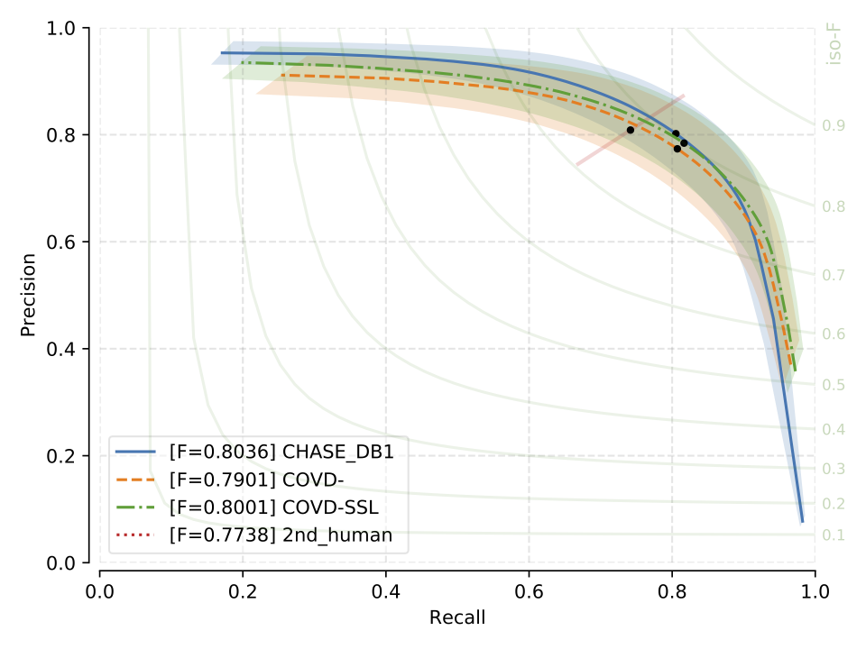

.. -*- coding: utf-8 -*-
.. _bob.ip.binseg.covdresults:

==========================
COVD- and COVD-SLL Results
==========================

F1 Scores
===========

F1 score together with standard deviation across test images.

+---------------------------------------------------------+---------------------------------------------+-----------------------------------------------+---------------------------------------------------+
| F1 score                                                | :ref:`bob.ip.binseg.configs.models.driu`    | :ref:`bob.ip.binseg.configs.models.driubn`    | :ref:`bob.ip.binseg.configs.models.m2unet`        |
+---------------------------------------------------------+---------------------------------------------+-----------------------------------------------+---------------------------------------------------+
| :ref:`bob.ip.binseg.configs.datasets.covd-drive`        | 0.788 (0.018)                               | 0.797 (0.019)                                 | `0.789 (0.018) <m2unet_covd-drive.pth>`_          |
+---------------------------------------------------------+---------------------------------------------+-----------------------------------------------+---------------------------------------------------+
| :ref:`bob.ip.binseg.configs.datasets.covd-drive_ssl`    | 0.785 (0.018)                               | 0.783 (0.019)                                 | `0.791 (0.014) <m2unet_covd-drive_ssl.pth>`_      |
+---------------------------------------------------------+---------------------------------------------+-----------------------------------------------+---------------------------------------------------+
| :ref:`bob.ip.binseg.configs.datasets.covd-stare`        | 0.778 (0.117)                               | 0.778 (0.122)                                 | `0.812 (0.046) <m2unet_covd-stare.pth>`_          |
+---------------------------------------------------------+---------------------------------------------+-----------------------------------------------+---------------------------------------------------+
| :ref:`bob.ip.binseg.configs.datasets.covd-stare_ssl`    | 0.788 (0.102)                               | 0.811 (0.074)                                 | `0.820 (0.044) <m2unet_covd-stare_ssl.pth>`_      |
+---------------------------------------------------------+---------------------------------------------+-----------------------------------------------+---------------------------------------------------+
| :ref:`bob.ip.binseg.configs.datasets.covd-chasedb1`     | 0.796 (0.027)                               | 0.791 (0.025)                                 | `0.788 (0.024) <m2unet_covd-chasedb1.pth>`_       |
+---------------------------------------------------------+---------------------------------------------+-----------------------------------------------+---------------------------------------------------+
| :ref:`bob.ip.binseg.configs.datasets.covd-chasedb1_ssl` | 0.796 (0.024)                               | 0.798 (0.025)                                 | `0.799 (0.026) <m2unet_covd-chasedb1_ssl.pth>`_   |
+---------------------------------------------------------+---------------------------------------------+-----------------------------------------------+---------------------------------------------------+
| :ref:`bob.ip.binseg.configs.datasets.covd-hrf`          | 0.799 (0.044)                               | 0.800 (0.045)                                 | `0.802 (0.045) <m2unet_covd-hrf.pth>`_            |
+---------------------------------------------------------+---------------------------------------------+-----------------------------------------------+---------------------------------------------------+
| :ref:`bob.ip.binseg.configs.datasets.covd-hrf_ssl`      | 0.799 (0.044)                               | 0.784 (0.048)                                 | `0.797 (0.044) <m2unet_covd-hrf_ssl.pth>`_        |
+---------------------------------------------------------+---------------------------------------------+-----------------------------------------------+---------------------------------------------------+
| :ref:`bob.ip.binseg.configs.datasets.covd-iostar`       | 0.791 (0.021)                               | 0.777 (0.032)                                 | `0.793 (0.015) <m2unet_covd-iostar.pth>`_         |
+---------------------------------------------------------+---------------------------------------------+-----------------------------------------------+---------------------------------------------------+
| :ref:`bob.ip.binseg.configs.datasets.covd-iostar_ssl`   | 0.797 (0.017)                               | 0.811 (0.074)                                 | `0.785 (0.018) <m2unet_covd-iostar_ssl.pth>`_     |
+---------------------------------------------------------+---------------------------------------------+-----------------------------------------------+---------------------------------------------------+

M2U-Net Precision vs. Recall Curves
===================================

Note that here the F1-score is calculated on a macro level (see paper for more details).

   CHASE_DB1: Precision vs Recall curve and F1 scores

.. figure:: img/pr_DRIVE.png
   :scale: 50 %
   :align: center
   :alt: model comparisons

   DRIVE: Precision vs Recall curve and F1 scores

.. figure:: img/pr_HRF.png
   :scale: 50 %
   :align: center
   :alt: model comparisons

   HRF: Precision vs Recall curve and F1 scores

.. figure:: img/pr_IOSTARVESSEL.png
   :scale: 50 %
   :align: center
   :alt: model comparisons

   IOSTAR: Precision vs Recall curve and F1 scores

.. figure:: img/pr_STARE.png
   :scale: 50 %
   :align: center
   :alt: model comparisons

   STARE: Precision vs Recall curve and F1 scores

