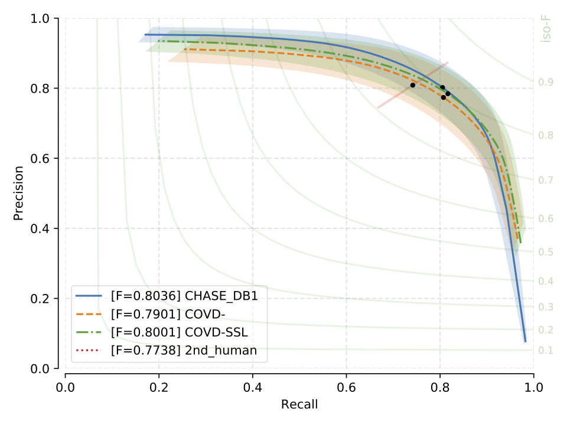
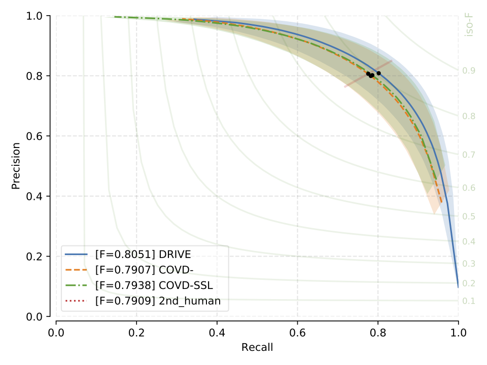
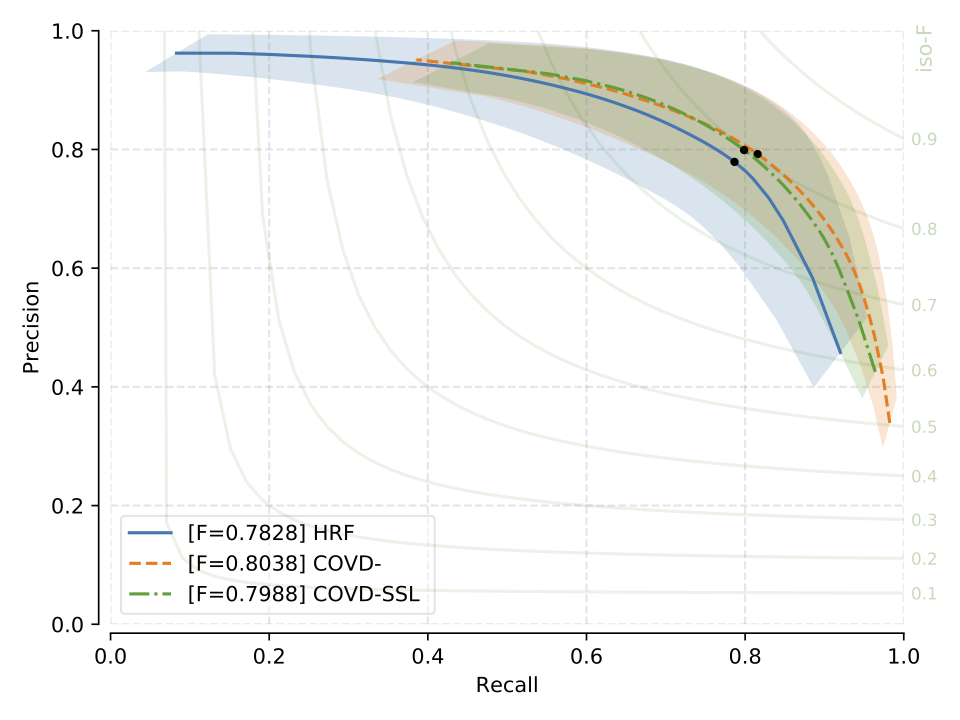
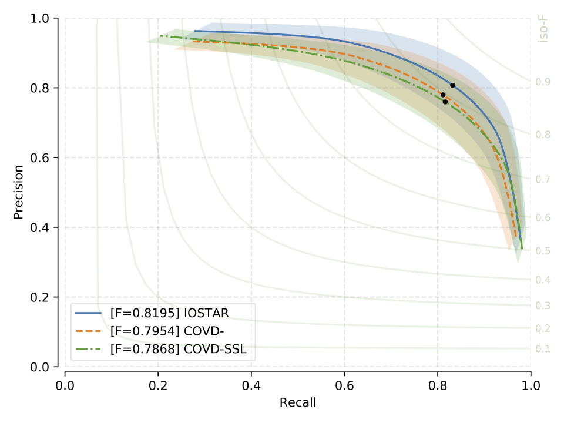
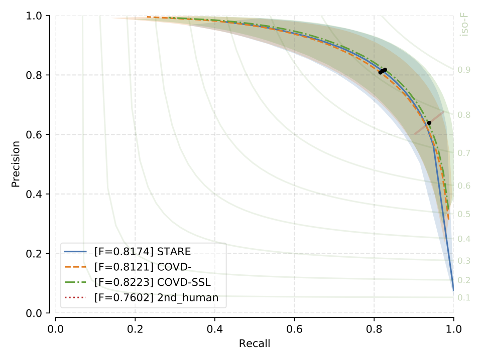

.. -*- coding: utf-8 -*-

.. _bob.ip.binseg.results.old:

.. todo::

   This section is outdated and needs re-factoring.

============================
 COVD- and COVD-SLL Results
============================

In addition to the M2U-Net architecture, we also evaluated the larger DRIU
network and a variation of it that contains batch normalization (DRIU+BN) on
COVD- (Combined Vessel Dataset from all training data minus target test set)
and COVD-SSL (COVD- and Semi-Supervised Learning). Perhaps surprisingly, for
the majority of combinations, the performance of the DRIU variants are roughly
equal or worse to the ones obtained with the much smaller M2U-Net.  We
anticipate that one reason for this could be overparameterization of large
VGG-16 models that are pretrained on ImageNet.

F1 Scores
---------

Comparison of F1 Scores (micro-level and standard deviation) of DRIU and
M2U-Net on COVD- and COVD-SSL.  Standard deviation across test-images in
brackets.

.. list-table::
   :header-rows: 1

   * - F1 score
     - :py:mod:`DRIU <bob.ip.binseg.configs.models.driu>`/:py:mod:`DRIU@SSL <bob.ip.binseg.configs.models.driu_ssl>`
     - :py:mod:`DRIU+BN <bob.ip.binseg.configs.models.driu_bn>`/:py:mod:`DRIU+BN@SSL <bob.ip.binseg.configs.models.driu_bn_ssl>`
     - :py:mod:`M2U-Net <bob.ip.binseg.configs.models.m2unet>`/:py:mod:`M2U-Net@SSL <bob.ip.binseg.configs.models.m2unet_ssl>`
   * - :py:mod:`COVD-DRIVE <bob.ip.binseg.configs.datasets.drive.covd>`
     - 0.788 (0.018)
     - 0.797 (0.019)
     - `0.789 (0.018) <m2unet_covd-drive.pth>`_
   * - :py:mod:`COVD-DRIVE+SSL <bob.ip.binseg.configs.datasets.drive.ssl>`
     - 0.785 (0.018)
     - 0.783 (0.019)
     - `0.791 (0.014) <m2unet_covd-drive_ssl.pth>`_
   * - :py:mod:`COVD-STARE <bob.ip.binseg.configs.datasets.stare.covd>`
     - 0.778 (0.117)
     - 0.778 (0.122)
     - `0.812 (0.046) <m2unet_covd-stare.pth>`_
   * - :py:mod:`COVD-STARE+SSL <bob.ip.binseg.configs.datasets.stare.ssl>`
     - 0.788 (0.102)
     - 0.811 (0.074)
     - `0.820 (0.044) <m2unet_covd-stare_ssl.pth>`_
   * - :py:mod:`COVD-CHASEDB1 <bob.ip.binseg.configs.datasets.chasedb1.covd>`
     - 0.796 (0.027)
     - 0.791 (0.025)
     - `0.788 (0.024) <m2unet_covd-chasedb1.pth>`_
   * - :py:mod:`COVD-CHASEDB1+SSL <bob.ip.binseg.configs.datasets.chasedb1.ssl>`
     - 0.796 (0.024)
     - 0.798 (0.025)
     - `0.799 (0.026) <m2unet_covd-chasedb1_ssl.pth>`_
   * - :py:mod:`COVD-HRF <bob.ip.binseg.configs.datasets.hrf.covd>`
     - 0.799 (0.044)
     - 0.800 (0.045)
     - `0.802 (0.045) <m2unet_covd-hrf.pth>`_
   * - :py:mod:`COVD-HRF+SSL <bob.ip.binseg.configs.datasets.hrf.ssl>`
     - 0.799 (0.044)
     - 0.784 (0.048)
     - `0.797 (0.044) <m2unet_covd-hrf_ssl.pth>`_
   * - :py:mod:`COVD-IOSTAR-VESSEL <bob.ip.binseg.configs.datasets.iostar.covd>`
     - 0.791 (0.021)
     - 0.777 (0.032)
     - `0.793 (0.015) <m2unet_covd-iostar.pth>`_
   * - :py:mod:`COVD-IOSTAR-VESSEL+SSL <bob.ip.binseg.configs.datasets.iostar.ssl>`
     - 0.797 (0.017)
     - 0.811 (0.074)
     - `0.785 (0.018) <m2unet_covd-iostar_ssl.pth>`_

M2U-Net Precision vs. Recall Curves
-----------------------------------

Precision vs. recall curves for each evaluated dataset.  Note that here the
F1-score is calculated on a macro level (see paper for more details).

   CHASE_DB1: Precision vs Recall curve and F1 scores

   DRIVE: Precision vs Recall curve and F1 scores

   HRF: Precision vs Recall curve and F1 scores

   IOSTAR: Precision vs Recall curve and F1 scores

   STARE: Precision vs Recall curve and F1 scores

.. include:: ../../links.rst
