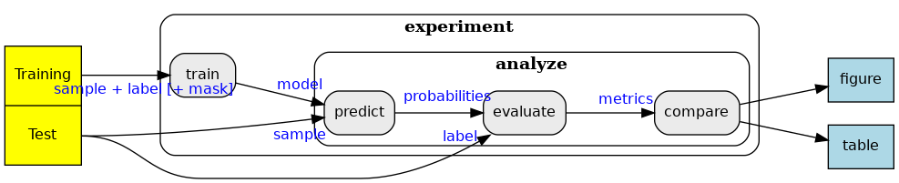

.. SPDX-FileCopyrightText: 2023 Idiap Research Institute <contact@idiap.ch>
..
.. SPDX-FileContributor: Tim Laibacher, tim.laibacher@idiap.ch
.. SPDX-FileContributor: Oscar Jiménez del Toro, oscar.jimenez@idiap.ch
.. SPDX-FileContributor: Maxime Délitroz, maxime.delitroz@idiap.ch
.. SPDX-FileContributor: Andre Anjos andre.anjos@idiap.ch
.. SPDX-FileContributor: Daniel Carron, daniel.carron@idiap.ch
..
.. SPDX-License-Identifier: GPL-3.0-or-later

.. _deepdraw.usage:

=======
 Usage
=======

This package supports a fully reproducible research experimentation cycle for
semantic binary segmentation with support for the following activities:

* Training: Images are fed to a Fully Convolutional Deep Neural Network (FCN),
  that is trained to reconstruct annotations (pre-segmented binary maps),
  automatically, via error back propagation.  The objective of this phase is to
  produce an FCN model.
* Inference (prediction): The FCN is used to generate vessel map predictions
* Evaluation: Vessel map predictions are used evaluate FCN performance against
  provided annotations, or visualize prediction results overlayed on
  the original raw images.
* Comparison: Use evaluation results to compare performance as you like, or to
  evaluate the significance between the results of two systems on the same
  dataset.

We provide :ref:`command-line interfaces (CLI) <deepdraw.cli>` that implement
each of the phases above. This interface is configurable using :ref:`clapper's
extensible configuration framework <clapper.config>`.  In essence, each
command-line option may be provided as a variable with the same name in a
Python file.  Each file may combine any number of variables that are pertinent
to an application.

.. tip::

   For reproducibility, we recommend you stick to configuration files when
   parameterizing our CLI.  Notice some of the options in the CLI interface
   (e.g. ``--dataset``) cannot be passed via the actual command-line as it
   may require complex Python types that cannot be synthetized in a single
   input parameter.

The following flowchart represents the various experiment phases and output
results that can be produced for each of our CLI interfaces (rounded white
rectangles).  Processing subproducts (marked in blue), are stored on disk by
the end of each step.

   Framework actions and CLI

We provide a number of :ref:`preset configuration files that you can check with "config list all"
<deepdraw.cli>` that can be used in one or more of the
activities described in this section.  Our command-line framework allows you to
refer to these preset configuration files using special names (a.k.a.
"resources"), that procure and load these for you automatically.  Aside preset
configuration files, you may also create your own to extend existing baseline
experiments by :ref:`locally copying with "config copy"<deepdraw.cli>` and
modifying one of our configuration resources.

.. toctree::
   :maxdepth: 2

   experiment
   training
   evaluation

.. include:: ../links.rst
